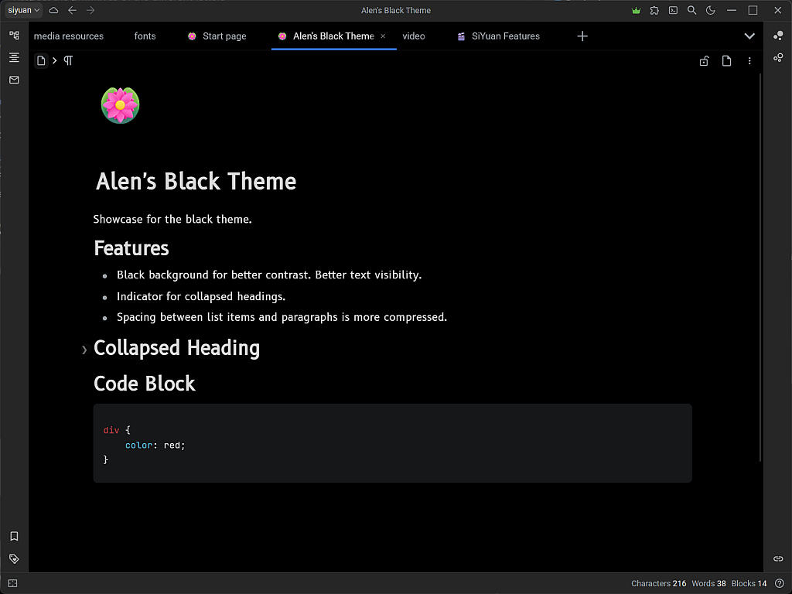

# Alen's Black Theme

The theme is designed to be dark and minimalistic, with a focus on readability and simplicity. It is intended to be used with a variety of applications and websites, and is compatible with a wide range of devices and screen sizes.

# Features

- Black background for better contrast. Better text visibility.
- Also has a light mode. Useful for e-Ink devices.
- Improved readability with fonts for text and code.
- Indicator for collapsed headings.
- Space between list items and paragraphs is smaller.

# License

This theme is licensed under the GNU Affero General Public License v3.0. See the [LICENSE](LICENSE) file for details.
